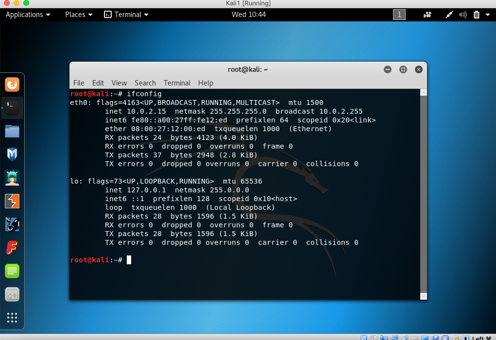

# russian-troll
## What is a russian-troll?
A russian troll is a bot that will post to a victim's social media account.
## How does it work?
This program will attempt to hijack a chosen victim's social media account and then post a message from their account, as if they were the one to post it. 

## The Trolling Procedure
1. Identify a target either through nmap on the network or using a already known IP.
    
   For simplicity of this design we will be using a known IP. 
   
2. Once a target has been selected, we will then use python and scapy to perform arp poisoning on the target machine to spoof the dns. The domains we will be spoofing will consist of social media login sites such as Facebook, Twitter, Instagram, etc... so that we can redirect the dns request to our fake login page.

3. Once the target reaches our fake login page we will steal their sign in credentials and use them to access their social media account. 

## In-Depth Analysis
The In-Depth Analysis section will consist of an example and analysis of this example to demonstrate the procedure.
#### _Identifying the Target_
This example will use two Kali Linux machines ran from a VirtualBox virtual machine on my host machine running MacOS. One Kali machine will be the attacker and the other Kali machine will be the target.

First, we will get the IP addresses of both of our machines on the network. 

From the above screenshots, we see that the Attackers IP on the network is 192.168.56.102
and the Target's IP is 192.168.56.101
